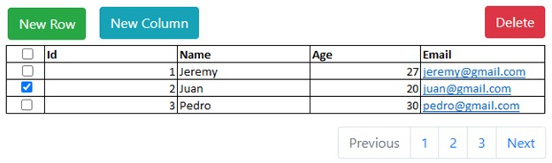

# DOM Practice

## Requirements

### Table should be dynamic

Starts empty, new rows and columns should be created when pressing the New Row and New Column buttons. The first row is considered the header of the table.

### Table should be sortable

When clicking on a header, the table should sort by the values on that column. For example, if you click on Id column, then the whole table should sort by the values in that Id column.

### Cells should be editable

When double clicking on a cell, it should get into the 'Editing' mode and allow the value to be changed. When hitting enter, it should get out of the 'Editing' mode and keep the new value.

### Table should be paginated

When the table has more than 10 records, the exceeding records should not be seen on the first page, but when you click on the next page. Should be able to go the the previous page as well. Should not try to go to a page that does exist (pagination buttons should activate and deactivate based on that logic). Pagination bar should have Previous, 1, 2, 3, ..., Next buttons.

### Cells should be typed

When clicking on `New Column`, a modal form should pop up to specify the type of that column. The form should have the following fields:

- Header: the text that will show up in the header (like Id, Name, Age, etc).
- Type: (can be number, string, email, url). This is to format the table accordingly. 
- - If it's an url, then when Ctrl + left clicking on the cell, it should take you to that link. 
- - If it's an email, it should open the mailto option to send an email. 
- - If it's a number, it should right align the context of the cell.
- - If it's a text, it should left align it.

Editable: if the cell will get into the editable mode when double clicking. The field should be a checkbox.

### Columns and Rows should be orderable

When you click on a column header and start to drag it, that column should be able to move from one position to another. For example, if we have columns Id, Name, Age, and I want to move Age to the second position, I should be able to hold it and drag it to the second position so the columns should now be: Id, Age, Name.